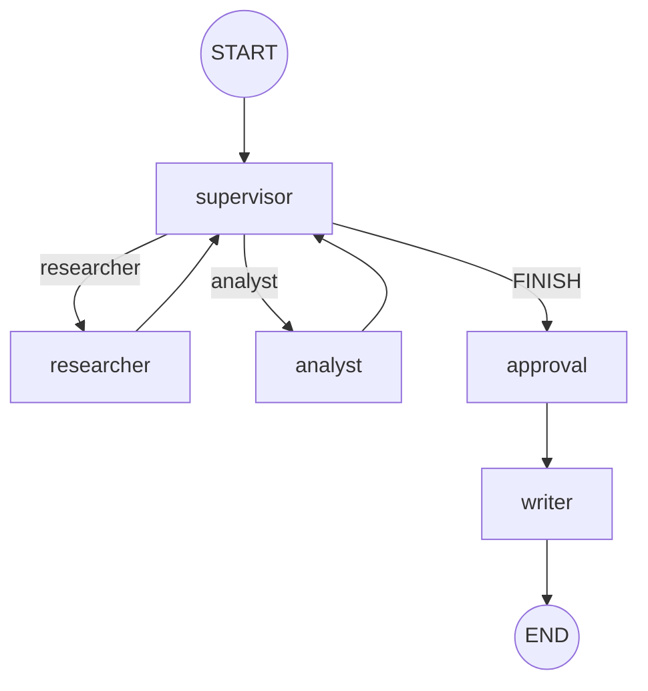

# Orquestador multi-agente (LangGraph)

Supervisor jerárquico para research: el **researcher** busca fuentes con **Tavily**,
el **analyst** puntúa sentimiento, el supervisor decide si falta alguien, y el
**writer** escribe `outputs/<tema>.md` al cerrar. Pre-entrega 7 del
[curso de AI Engineering](https://github.com/ramiro-c/ai-engineering-coderhouse-course).

La capa `app/` expone una API FastAPI asíncrona: los jobs viven en Redis, las
trazas van a **Arize Phoenix**, y antes de escribir a disco el grafo se pausa en
**human-in-the-loop** (`approval`) hasta que alguien llame `POST /tasks/{id}/approve`.

Los especialistas son `langchain.agents.create_agent` (sucesor de
`create_react_agent`, deprecado en LangGraph v1). El grafo padre es un
`StateGraph` armado a mano.

## Requisitos

- Python 3.12+ y `pip`
- Docker (para Redis Stack, RedisInsight y Phoenix)
- `TAVILY_API_KEY` ([app.tavily.com](https://app.tavily.com))
- Credencial LLM según `LLM_PROVIDER` en `.env`

## Inicio rápido (API)

### 1. Infraestructura

Redis Stack (RedisJSON para el checkpointer), RedisInsight y Phoenix:

```bash
docker compose up -d
```

- Redis: `localhost:6379`
- RedisInsight: [http://localhost:5540](http://localhost:5540) — al conectar, host `redis` y puerto `6379` (el nombre del servicio, no `localhost`)
- Phoenix UI: [http://localhost:6006](http://localhost:6006)

### 2. Python y variables

```bash
python -m venv .venv && source .venv/bin/activate
pip install -r requirements.txt
cp .env.example .env   # TAVILY_API_KEY, LLM_PROVIDER, REDIS_URL, PHOENIX_COLLECTOR_ENDPOINT
```

Corré los scripts desde la raíz del repo: `load_dotenv()` lee el `.env` de acá.
Nunca commitees el `.env`.

### 3. API en el host

```bash
uvicorn app.main:app --reload
```

La app **no** va en Docker: solo Redis, RedisInsight y Phoenix.

### 4. Probar con curl

Crear un job (no bloquea; responde al instante con `job_id`):

```bash
curl -s -X POST http://127.0.0.1:8000/tasks \
  -H 'Content-Type: application/json' \
  -d '{"query": "¿Qué se dice de LangGraph vs CrewAI esta semana?"}'
```

Consultar estado:

```bash
curl -s http://127.0.0.1:8000/tasks/<job_id>
```

Cuando el supervisor elige `FINISH`, el grafo llega a `approval` y el status pasa a
`AWAITING_APPROVAL` (incluye `research_notes` y `analysis` en el hash del job).
Aprobar y dejar que el writer escriba `outputs/<tema>.md`:

```bash
curl -s -X POST http://127.0.0.1:8000/tasks/<job_id>/approve
```

Estados terminales: `DONE`, `FAILED`, o `AWAITING_APPROVAL` (pausa hasta approve).

### 5. Load test (5 consultas concurrentes)

Con la API corriendo:

```bash
python scripts/load_test.py
```

Opcional: `--base-url`, `--timeout`, `--interval`. Imprime `job_id` y `status` en
cada poll.

### 6. Observabilidad

Después del load test, abrí [http://localhost:6006](http://localhost:6006) y revisá
las trazas de LangChain. Instrucciones para capturas en `screenshots/README.md`.

## Demo local (sin API)

REPL del orquestador, sin Redis ni HITL:

```bash
python demo.py              # REPL: una consulta por turno, 'salir' para terminar
python demo.py --trace      # mismo REPL + hops, traces/ y outputs/<tema>.md
```

En cada turno con `--trace` escribe:

- `outputs/<tema>.md` — research (notes + análisis), un archivo por consulta
- `traces/delegation.log` — hops + slots, legible
- `traces/delegation.json` — lo mismo en JSON

Video del entregable: [docs/demo-orquestador.mov](docs/demo-orquestador.mov)
Ejemplo de salida: [docs/output-example.md](docs/output-example.md)

## Arquitectura

Las aristas punteadas son condicionales: el supervisor elige `researcher`,
`analyst` o `FINISH`. `FINISH` no va directo a `END`: en la **API con HITL** pasa
por `approval` (pausa humana) y luego `writer`, que escribe `outputs/<tema>.md`.
En `demo.py` (sin HITL) `FINISH` va directo al `writer`.



Flujo típico (API):

`supervisor → researcher → supervisor → analyst → supervisor → approval → (approve) → writer → END`

Los especialistas no se hablan entre sí: siempre vuelven al supervisor. Es
topología **jerárquica** (router + especialistas), no swarm.

### Cómo evita loops y conflictos

- **Slots separados.** `research_notes` y `analysis` se pisan por dueño. El
  researcher no puede borrar el analysis.
- **Contexto acotado.** Cada especialista recibe la tarea aislada, no el chat
  interno del grafo. El analyst no ve las tool calls de Tavily.
- **Rúbrica dura.** El código pisa la decisión del LLM: sin notas no hay
  `FINISH`; `FINISH` sin análisis cae a `analyst`; 6 pasos de tope cortan el
  bucle sí o sí.
- **Cómputo fuera del LLM.** El score de sentimiento lo calcula una función
  determinista, no el modelo.
- **Errores transitorios.** Reintentos con backoff para 502 y errores de free
  tier; si se agotan, escribe el error y cierra igual por el `writer`. Un 403
  no se reintenta.

| Componente              | Responsabilidad                                                          |
| ----------------------- | ------------------------------------------------------------------------ |
| `OrchestratorState`     | `MessagesState` + `next_agent`, slots, `step_count`, `last_error`        |
| `supervisor`            | Elige el próximo nodo (`researcher` / `analyst` / `FINISH`) + rúbrica    |
| `researcher`            | `create_agent` + `TavilySearch` → `research_notes`                       |
| `analyst`               | `create_agent` + tool de sentimiento → `analysis`                        |
| `approval`              | HITL: `interrupt()` antes del writer; resume vía `POST .../approve`      |
| `route_from_supervisor` | Arista condicional: `FINISH` → `approval` o `writer` según modo        |
| `writer`                | Escribe `outputs/<tema>.md` con consulta + notes + análisis (gitignored) |
| `JobStore` / `worker`   | Estado del job en Redis; grafo en thread pool sin bloquear la API        |
| `RetryPolicy`           | Reintento de transitorios; `error_handler` cierra vía `writer`           |

## Tests

```bash
python -m pytest tests/ -q
```

Cubren estado/aislamiento de contexto, rúbrica del supervisor, topología del
grafo, jobs en Redis, HITL, API y observabilidad. No pegan a Tavily ni al LLM
en vivo.
