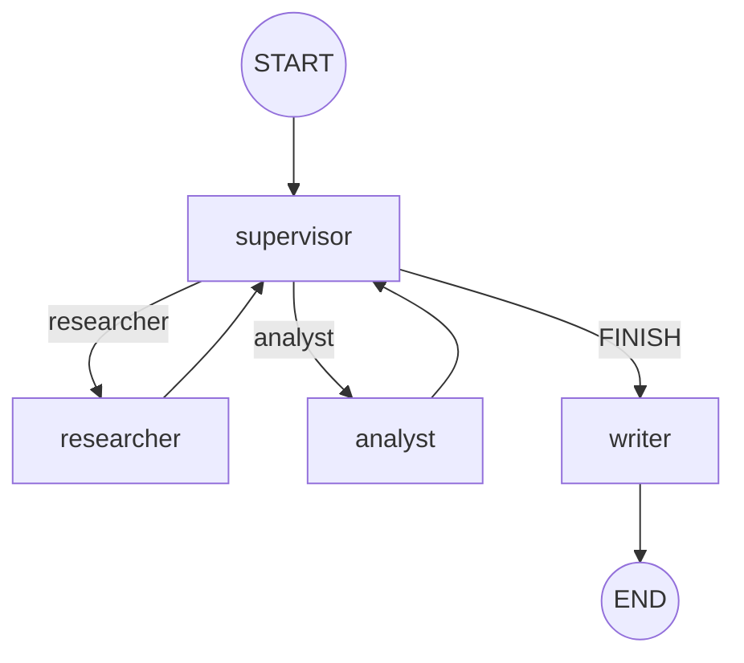

# Orquestador multi-agente (LangGraph)

Supervisor jerárquico que rutea un **brief de mercado**: el **researcher** busca
fuentes con **Tavily**, el **analyst** puntúa sentimiento con una tool de
cómputo, el supervisor decide si falta alguien, y el **writer** pisa
`output.md` al cerrar.

Nació como pre-entrega 6 del [curso de AI Engineering](https://github.com/ramiro-c/ai-engineering-coderhouse-course).

Los especialistas son `langchain.agents.create_agent` (sucesor de
`langgraph.prebuilt.create_react_agent`, deprecado en LangGraph v1). El grafo
padre es un `StateGraph` armado a mano.

## Requisitos

- Python 3.12+ y `pip`
- `TAVILY_API_KEY` ([app.tavily.com](https://app.tavily.com))
- Credencial LLM según `LLM_PROVIDER` (recomendado: `openrouter`)


## Inicio rápido

```bash
python -m venv .venv && source .venv/bin/activate
pip install -r requirements.txt
cp .env.example .env        # completá TAVILY_API_KEY + el provider
python demo.py --trace      # REPL + hops, traces/ y output.md
python demo.py              # REPL sin dump de trazas
```

> **El venv no es opcional.** Corré los scripts desde la raíz del repo para que
> `load_dotenv()` lea el `.env` de acá.


### `.env`

- `TAVILY_API_KEY` — tool del researcher.
- `LLM_PROVIDER=openrouter` y `OPENROUTER_API_KEY` — un modelo distinto por rol
(ver abajo). Alternativa: `gemini` + Vertex/ADC.
- Nunca commitees el `.env`.


## Arquitectura del grafo

Grafo compilado (`graph.get_graph()`). Las aristas punteadas son
condicionales: el supervisor elige `researcher`, `analyst` o `FINISH`.
`FINISH` no va a `END`: pasa por `writer`, que pisa `output.md`.



Flujo feliz de la demo:

`supervisor → researcher → supervisor → analyst → supervisor → writer → END`

Los especialistas **no** se hablan entre sí. Siempre vuelven al supervisor.
Eso es topología **jerárquica** (router + especialistas), no swarm.

### Por qué esta topología

Un brief de mercado pide dos oficios distintos: **conseguir fuentes** y
**puntuar lo que se consiguió**. Si un solo ReAct hace las dos cosas, el
modelo mezcla búsqueda con opinión y no hay rúbrica de “¿alcanza?”. El
supervisor no investiga: solo elige el próximo nodo (`Literal`) o `FINISH`.

### Cómo se manejan los conflictos

- **Slots separados.** `research_notes` y `analysis` se pisan por dueño, no se
appendan. El researcher no puede borrar el analysis.
- **Contexto acotado.** Cada especialista recibe la tarea aislada, no el chat
interno del grafo. El analyst no ve las tool calls de Tavily.
- **Rúbrica en código + prompt.** `apply_rubric` pisa al LLM: sin notes no hay
`FINISH`; `FINISH` sin analysis cae a `analyst`; `step_count >= MAX_STEPS`
(6) cierra sí o sí. Eso corta el supervisor infinito.
- **Cómputo fuera del LLM.** El score de sentimiento lo calcula
`puntuar_sentimiento`, no el modelo.
- **Errores transitorios en el grafo.** `RetryPolicy` reintenta 502 /
`Provider returned error` del free tier. Si se agotan los intentos,
`error_handler` escribe `last_error` y va a `writer` (igual pisa
`output.md`). Un 403 no se reintenta.


| Componente              | Responsabilidad                                                          |
| ----------------------- | ------------------------------------------------------------------------ |
| `OrchestratorState`     | `MessagesState` + `next_agent`, slots, `step_count`, `last_error`        |
| `supervisor`            | Structured output `Literal["researcher", "analyst", "FINISH"]` + rúbrica |
| `researcher`            | `create_agent` + `TavilySearch` → `research_notes`                       |
| `analyst`               | `create_agent` + `puntuar_sentimiento` → `analysis`                      |
| `route_from_supervisor` | Arista condicional: `FINISH` → `writer` → `END`                          |
| `writer`                | Pisa `output.md` con consulta + notes + analysis (gitignored)            |
| `RetryPolicy`           | Reintento de transitorios; `error_handler` cierra vía `writer`           |


### Modelos (OpenRouter)


| Rol        | Modelo                                   | Motivo                                                                       |
| ---------- | ---------------------------------------- | ---------------------------------------------------------------------------- |
| Supervisor | `nvidia/nemotron-3-ultra-550b-a55b:free` | Ruteo frecuente; SKU reasoning; structured output; el más rápido de los tres |
| Researcher | `poolside/laguna-s-2.1:free`             | Agentic + tools (Tavily). Inkling no se puede llamar por API; Laguna sí      |
| Analyst    | `minimax/minimax-m3:free`                | Mejor razonamiento/IF de los tres para contar evidencia                      |


Con `gemini` / `openai` / `anthropic` los tres nodos comparten el modelo default.
En Gemini desactivamos el AFC del SDK: el loop de tools lo corre `create_agent`.

## Demo del flujo de delegación

Video del entregable (`python demo.py --trace`, hops y `output.md`):

[docs/demo-orquestador.mov](docs/demo-orquestador.mov)

`python demo.py --trace` es un REPL: escribís la consulta (Enter vacío usa
LangGraph vs CrewAI) y en cada turno escribe:

- `output.md` — brief (notes + analysis), pisado en cada corrida
- `traces/delegation.log` — hops + slots, legible
- `traces/delegation.json` — lo mismo en JSON


## Tests

```bash
python -m pytest tests/ -q
```

Cubren estado/aislamiento de contexto, rúbrica del supervisor, topología del
grafo, el mapeo OpenRouter por rol y el clasificador de errores transitorios.
No pegan a Tavily ni al LLM.