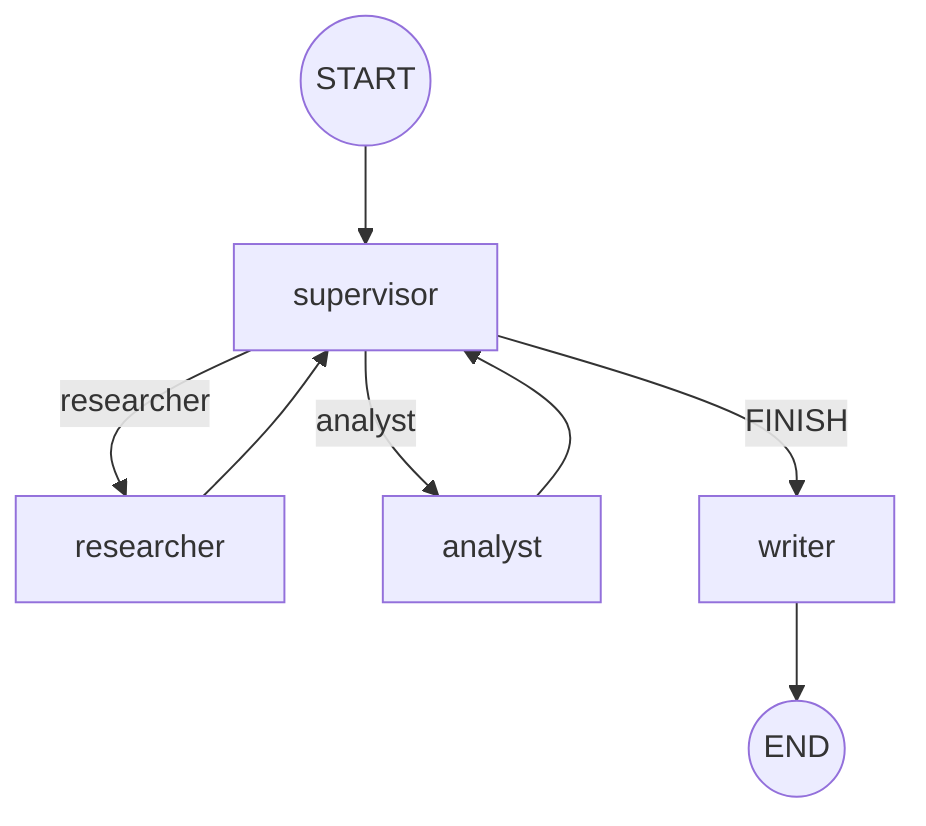

# Orquestador multi-agente (LangGraph)

Supervisor jerárquico para research: el **researcher** busca fuentes
con **Tavily**, el **analyst** puntúa sentimiento, el supervisor decide si
falta alguien, y el **writer** pisa `output.md` al cerrar. Pre-entrega 6 del
[curso de AI Engineering](https://github.com/ramiro-c/ai-engineering-coderhouse-course).

Los especialistas son `langchain.agents.create_agent` (sucesor de
`create_react_agent`, deprecado en LangGraph v1). El grafo padre es un
`StateGraph` armado a mano.

## Requisitos

- Python 3.12+ y `pip`
- `TAVILY_API_KEY` ([app.tavily.com](https://app.tavily.com))
- Credencial LLM según `LLM_PROVIDER` (recomendado: `openrouter`)

## Inicio rápido

```bash
python -m venv .venv && source .venv/bin/activate
pip install -r requirements.txt
cp .env.example .env        # completá TAVILY_API_KEY + el provider
python demo.py              # REPL sin dump de trazas
python demo.py --trace      # REPL + hops, traces/ y output.md
```

Corré los scripts desde la raíz del repo: `load_dotenv()` lee el `.env` de acá.
Nunca commitees el `.env`.

### `.env`

- `TAVILY_API_KEY` — tool del researcher.
- `LLM_PROVIDER=openrouter` y `OPENROUTER_API_KEY` — un modelo por rol.
  Alternativa: `gemini` + Vertex/ADC.

## Arquitectura

Las aristas punteadas son condicionales: el supervisor elige `researcher`,
`analyst` o `FINISH`. `FINISH` no va a `END`: pasa por `writer`, que pisa
`output.md`.



Flujo típico:

`supervisor → researcher → supervisor → analyst → supervisor → writer → END`

Los especialistas no se hablan entre sí: siempre vuelven al supervisor. Es
topología **jerárquica** (router + especialistas), no swarm.

### Cómo evita loops y conflictos

- **Slots separados.** `research_notes` y `analysis` se pisan por dueño. El
  researcher no puede borrar el analysis.
- **Contexto acotado.** Cada especialista recibe la tarea aislada, no el chat
  interno del grafo. El analyst no ve las tool calls de Tavily.
- **Rúbrica dura.** El código pisa la decisión del LLM: sin notas no hay
  `FINISH`; `FINISH` sin análisis cae a `analyst`; 6 pasos de tope cortan el
  bucle sí o sí.
- **Cómputo fuera del LLM.** El score de sentimiento lo calcula una función
  determinista, no el modelo.
- **Errores transitorios.** Reintentos con backoff para 502 y errores de free
  tier; si se agotan, escribe el error y cierra igual por el `writer`. Un 403
  no se reintenta.

| Componente              | Responsabilidad                                                          |
| ----------------------- | ------------------------------------------------------------------------ |
| `OrchestratorState`     | `MessagesState` + `next_agent`, slots, `step_count`, `last_error`        |
| `supervisor`            | Elige el próximo nodo (`researcher` / `analyst` / `FINISH`) + rúbrica    |
| `researcher`            | `create_agent` + `TavilySearch` → `research_notes`                       |
| `analyst`               | `create_agent` + tool de sentimiento → `analysis`                        |
| `route_from_supervisor` | Arista condicional: `FINISH` → `writer` → `END`                          |
| `writer`                | Pisa `output.md` con consulta + notes + análisis (gitignored)            |
| `RetryPolicy`           | Reintento de transitorios; `error_handler` cierra vía `writer`           |

### Modelos

`openrouter` permite usar un modelo distinto por rol (se configuran en
`clients/factory.py`). Con `gemini`, `openai` o `anthropic` los tres nodos
comparten el modelo default del provider.

## Demo

`python demo.py` es un REPL: escribís la consulta (Enter vacío corre la demo de
LangGraph vs CrewAI) y en cada turno escribe:

- `output.md` — research (notes + análisis), pisado en cada corrida
- `traces/delegation.log` — hops + slots, legible
- `traces/delegation.json` — lo mismo en JSON

Video del entregable: [docs/demo-orquestador.mov](docs/demo-orquestador.mov)
Ejemplo de lo que retorna: [docs/output-example.md](docs/output-example.md)

## Tests

```bash
python -m pytest tests/ -q
```

Cubren estado/aislamiento de contexto, rúbrica del supervisor, topología del
grafo, el mapeo por rol y el clasificador de errores transitorios. No pegan a
Tavily ni al LLM.